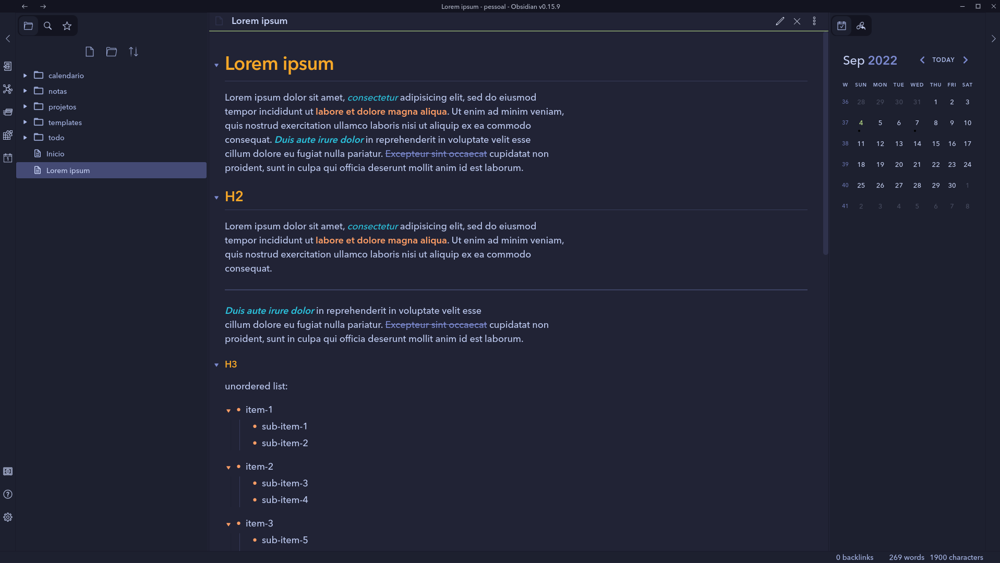

# Tokyo Light Obsidian Theme
A Light and Dark theme for [Obsidian](https://obsidian.md/) __forked from [Tokyo Dark Obisidian Theme](https://github.com/lokesh-krishna/Tokyo-Night-Obsidian-Theme)__





## Install
1. Download obsidian.css to your Obsidian vault folder.
2. In Obsidian, click ```Settings->Plugins``` and turn on "Custom CSS".
3. There is no step 3! Enjoy!

## License
I don't really care what happens to this theme, so I put it under [The Unlicense](./LICENSE) and set it free!

## Version
04/07/2022 - Rev. 2.1 - Light theme
22/07/2021 - Rev. 2.0 - All been updated now
